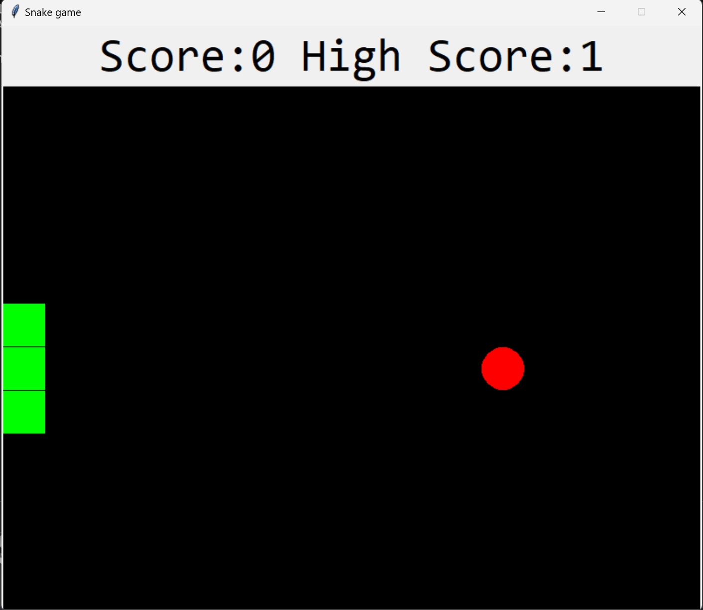
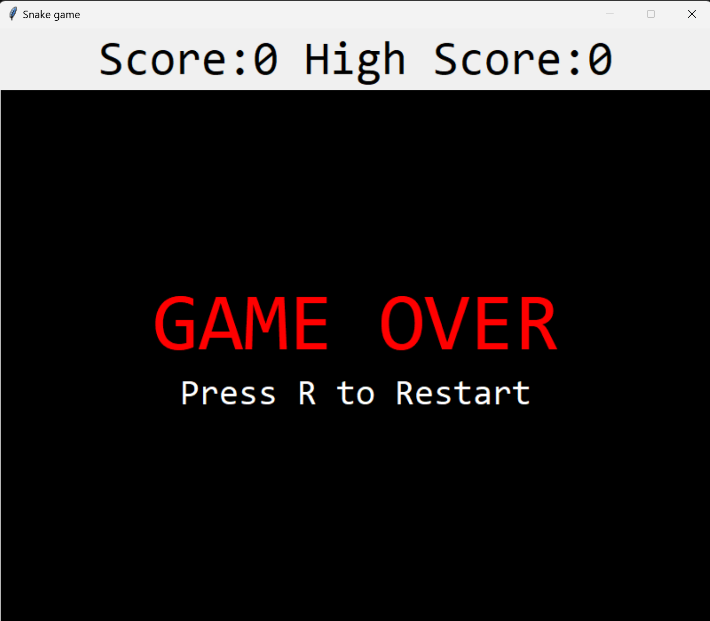

# Snake Game

This is a classic Snake game implemented using the `tkinter` library in Python. The game involves controlling a snake to eat food that appears randomly on the screen. Each time the snake eats the food, it grows longer and the score increases. The objective is to achieve the highest score possible without colliding with the walls or the snake's own body.

## How to Play

1. **Start the Game:** Run the script to start the game.
2. **Control the Snake:** Use the arrow keys (`Up`, `Down`, `Left`, `Right`) to control the direction of the snake.
3. **Eat Food:** Guide the snake to the food to grow longer and increase your score.
4. **Avoid Collisions:** Do not hit the walls or the snake's own body.
5. **Game Over:** If a collision occurs, the game will end and display your score. Press 'R' to restart the game.

## Requirements

- Python
- `tkinter` library (usually included with Python)

## How to Run

1. Clone the repository:
   ```sh
   git clone https://github.com/rupanraj19/Snake_game.git
   cd snake-game
   
2. Run the Game:
   ```sh
   python snake_game.py
   
## Gameplay
<div>
<p align="center">
  
</p> <br>
<p align="center">
  
</p>
</div>


